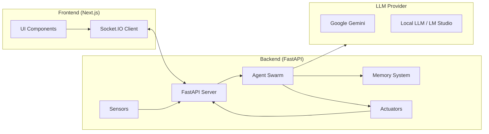
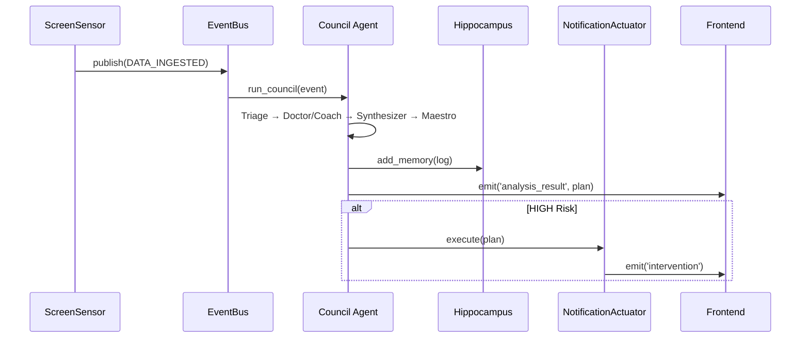
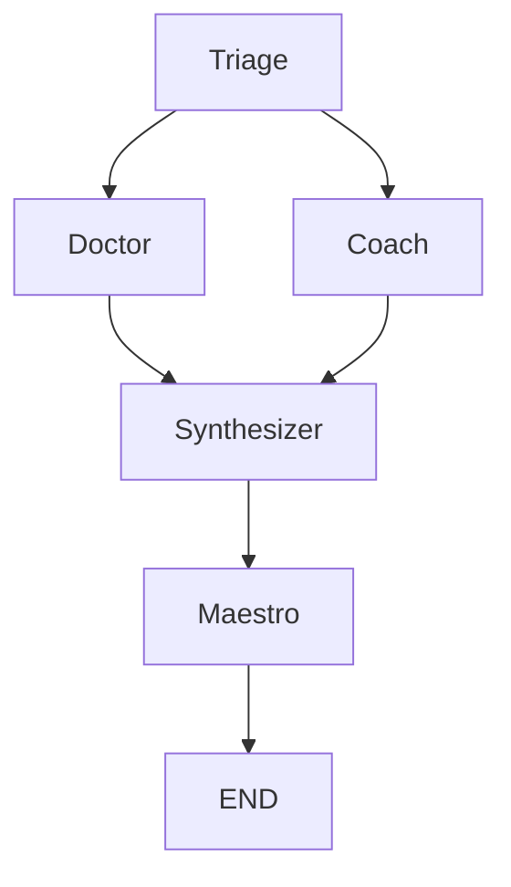

# VitalSense: Comprehensive Project Guide

> **"Highly Autonomous. Highly Intelligent. Highly Perceptive."**

[English](PROJECT_GUIDE.md) | [中文文档](PROJECT_GUIDE_CN.md)

This guide is the ultimate reference for understanding VitalSense—a next-generation **Autonomous Multi-Agent Health Operating System (VitalOS)**. It covers everything from the philosophical foundation to advanced usage patterns.

---

## Table of Contents
1. [Project Philosophy](#1-project-philosophy)
2. [Architecture & Tech Stack](#2-architecture--tech-stack)
3. [Information Flow & Core Principles](#3-information-flow--core-principles)
4. [Key Technologies & Features](#4-key-technologies--features)
5. [Basic Usage Guide](#5-basic-usage-guide)
6. [Full Capabilities](#6-full-capabilities)
7. [Advanced Usage & Examples](#7-advanced-usage--examples)
8. [Appendix](#8-appendix)

---

## 1. Project Philosophy

### The "Sentient" Trinity

VitalSense is designed to transcend traditional chatbots and health trackers. It aspires to be a **Sentient Private Assistant**, embodying three core principles:

| Principle | Description |
|-----------|-------------|
| **High Autonomy** | Acts without constant prompting. Manages memories, suppresses alerts, and uses tools to solve problems. |
| **High Intelligence** | Uses **GraphRAG** (Graph Retrieval-Augmented Generation) to understand context, calculate durations, and detect complex patterns like "The Grind" (prolonged sedentary work). |
| **High Perception** | "Sees" the user's screen (via LLM Vision), "remembers" history, and builds an evolving `UserProfile`. |

### Design Mantra
- **Proactive, Not Reactive**: The system intervenes *before* burnout, not after.
- **Ambient Intelligence**: It runs in the background, always watching, always learning.
- **Feedback Loop**: User actions (dismissing alerts) directly tune the system's sensitivity.

---

## 2. Architecture & Tech Stack

### High-Level Diagram



### Tech Stack Overview

| Layer | Technology | Purpose |
|-------|------------|---------|
| **Frontend** | Next.js, TypeScript, Tailwind CSS, Framer Motion, `react-force-graph-3d` | Rich, interactive UI with 3D graph visualization. |
| **Backend** | Python, FastAPI, Socket.IO, LangGraph, LangChain | Real-time API, agent orchestration. |
| **Memory** | ChromaDB, NetworkX | Vector storage (ChromaDB), Knowledge Graph (NetworkX). |
| **LLM** | Google Gemini (Cloud), OpenAI-compatible API (Local) | Multimodal reasoning, structured output. |
| **Actuators** | `osascript` (macOS), `screen-brightness-control` | System notifications, screen brightness. |

---

## 3. Information Flow & Core Principles

### The Event-Driven Pipeline

VitalSense operates on a **publish-subscribe (pub/sub)** event bus. This architecture decouples components and enables parallel processing.



### Key Data Structures

| Model | File | Purpose |
|-------|------|---------|
| `MemoryEntry` | `schemas.py` | Structured memory for GraphRAG (timestamp, scene, statement, entities, user_state, outcome). |
| `CouncilActionPlan` | `schemas.py` | Output of the Council (summary, risk_level, risk_type, actions, graph_highlights). |
| `UserProfile` | `profile_service.py` | Persistent user model (traits, conditions, habits, preferences, risk_modifiers). |
| `ScreenAnalysis` | `screen_sensor.py` | Vision analysis output (activity_category, health_risk_detected, emotional_tone, description). |

---

## 4. Key Technologies & Features

### 4.1 GraphRAG (Graph Retrieval-Augmented Generation)

VitalSense doesn't just keyword-match memories—it builds a **Knowledge Graph** and traverses it.

| Component | Technology | Role |
|-----------|------------|------|
| `GraphService` | NetworkX | Stores nodes (Memory, Activity, Symptom, Entity) and edges (MENTIONS, CAUSES, etc.). |
| `GraphEnricher` | LLM | Extracts entities and relationships from raw text using a prompt-based approach. |

**Pattern Detection:**
The `detect_grind_pattern()` method traverses the graph to find continuous blocks of sedentary activity, calculating total duration. If it exceeds a threshold (e.g., 60 minutes), a `GRAPH_ALERT` is raised.

---

### 4.2 Multi-Agent Council (LangGraph)

The Council is a **LangGraph** workflow that orchestrates multiple specialized agents in a debate-style architecture.



| Agent | Persona | Role |
|-------|---------|------|
| **Triage** | Router | Scans input, decides if Doctor/Coach are needed. |
| **Dr. Nexus** | Clinician | Analyzes medical/physiological symptoms. |
| **Guardian** | Coach | Analyzes lifestyle and behavioral patterns. |
| **Chair (Synthesizer)** | Mediator | Combines inputs, runs Risk Engine, outputs `CouncilActionPlan`. |
| **Maestro** | Environment Controller | Adjusts screen brightness, suggests ambient color. |

---

### 4.3 Hybrid Risk Engine

The `RiskEngine` combines fast deterministic rules with deep GraphRAG analysis.

| Check | Logic |
|-------|-------|
| **Deterministic** | Keyword matching for symptoms ("headache", "chest pain"), neglect ("skipped meal"), and duration multipliers. |
| **GraphRAG** | Calls `detect_grind_pattern()` to find temporal patterns in the Knowledge Graph. |
| **Dynamic Modifiers** | User profile modifiers (e.g., `sedentary: 1.5`) amplify or dampen risk scores based on user conditions. |

---

### 4.4 Autonomous Memory Consolidation

Inspired by how brains consolidate memories during sleep, VitalSense runs a **Wake-Up Protocol** on startup:
1. **Check Gap**: If the system was off for >4 hours, trigger consolidation.
2. **Summarize**: Use LLM to summarize raw logs into a high-level "Episode".
3. **Archive**: Move raw data to `cold_storage/` (zero data loss).
4. **Prune**: Delete raw memories from ChromaDB to keep the context window clean.

---

### 4.5 Local LLM Support (LM Studio / Ollama)

VitalSense supports a **hybrid brain** architecture:

| Mode | Provider | Pros |
|------|----------|------|
| **Cloud** | Google Gemini | Fast, powerful multimodal, no local resources. |
| **Local** | LM Studio / Ollama (OpenAI-compatible) | Privacy-first, no data leaves your machine, works offline. |

**Auto-Detection:** The `LocalProvider` queries `/v1/models` to automatically detect the loaded model ID, eliminating configuration errors.

---

## 5. Basic Usage Guide

### Quick Start

**Prerequisites:**
- Python 3.10+
- Node.js 18+
- Google Gemini API Key OR LM Studio

**Step 1: Backend**
```bash
cd backend
pip install -r requirements.txt

# Cloud Mode (Gemini)
export GOOGLE_API_KEY="your_key"
python -m backend.main

# Local Mode (LM Studio)
export LLM_PROVIDER="local"
python -m backend.main
```

**Step 2: Frontend**
```bash
cd frontend
npm install
npm run dev
```

Visit `http://localhost:3000`.

---

### Interacting with the Agent

| Action | How |
|--------|-----|
| **Chat** | Type messages in the "Liaison AI" chat window (bottom-right). |
| **View Memory Graph** | The "Neural Constellation" 3D graph updates in real-time. Click nodes to inspect. |
| **Manage Memories** | Click the Database icon in the graph header to open the Memory Manager. |
| **Respond to Alerts** | When a `RiskCard` appears, click "I'll fix it" or "Not now" to provide feedback. |

---

## 6. Full Capabilities

### 6.1 Perception

| Sensor | Input | Output |
|--------|-------|--------|
| **ScreenSensor** | Screenshot (every 30s) | `ScreenAnalysis` (activity, risk, emotion) + Base64 thumbnail. |
| **FileSensor** | JSON file (`backend/data/input.json`) | Arbitrary events for testing/simulation. |

---

### 6.2 Cognition (Agent Tools)

The **Liaison Agent** has a ReAct loop with 6 tools:

| Tool | Function |
|------|----------|
| `update_profile` | Adds/removes traits, conditions, habits. Triggers `RiskEngine` modifiers. |
| `manage_memory` | Searches or deletes memories from the Hippocampus. |
| `set_preference` | Sets system preferences (e.g., `mute_alerts`). |
| `query_graph` | **Smart Query**: Combines timeline data, semantic search, and grind detection. |
| `set_risk_override` | Suppresses a risk type for a duration (Focus Mode). |
| `fetch_profile_context` | Retrieves profile data (traits, conditions, etc.). |

---

### 6.3 Action (Actuators)

| Actuator | Action |
|----------|--------|
| **NotificationActuator** | Sends macOS system notifications for HIGH risk events. |
| **BrightnessActuator** | Adjusts screen brightness based on Maestro's recommendation. |

---

### 6.4 Frontend Components

| Component | Purpose |
|-----------|---------|
| **ChatInterface** | Draggable chat widget with embedded `RiskCard` support. |
| **MemoryGalaxy** | 3D force-directed Knowledge Graph visualization. |
| **CouncilRoom** | Real-time log of agent activity. |
| **SessionTimeline** | Horizontal timeline of screen snapshots with risk indicators. |
| **InterventionModal** | Full-screen alert for HIGH risk events. |
| **BioField** | Ambient background shader controlled by Maestro. |

---

## 7. Advanced Usage & Examples

### 7.1 Focus Mode (Autonomy)

**Scenario:** User says "I need to focus for the next 2 hours, no reminders."

**Agent Flow:**
1. Liaison recognizes intent.
2. Calls `set_risk_override("duration", 2, "User requested focus time")`.
3. Also calls `set_preference("mute_alerts", "true")`.
4. For the next 2 hours, alerts are suppressed.

**User Command:**
> "I'm going to be in a meeting for 3 hours, stop bothering me."

---

### 7.2 Dynamic User Modeling (Intelligence)

**Scenario:** User mentions "My back has been killing me lately."

**Agent Flow:**
1. Liaison detects health condition.
2. Calls `update_profile(key="condition", value="Back Pain", action="add")`.
3. `ProfileService` automatically sets `risk_modifiers["sedentary"] = 1.5`.
4. Future sedentary alerts are triggered 1.5x sooner.

**User Command:**
> "I have been diagnosed with mild dry eye."

---

### 7.3 Deep Recall (Intelligence)

**Scenario:** User asks "What have I been doing for the past hour?"

**Agent Flow:**
1. Liaison calls `query_graph("What have I been doing for the past hour?")`.
2. `GraphService.get_recent_activity()` retrieves memories with calculated durations.
3. Liaison synthesizes a narrative: "In the last hour, you spent 45 minutes coding (Ongoing), preceded by 15 minutes of email review."

---

### 7.4 Feedback Loop (Perception)

**Scenario:** User dismisses a "Sedentary Risk" card multiple times.

**Frontend Flow:**
1. User clicks "Not now" on `RiskCard`.
2. Frontend emits `adjust_tolerance({ risk_type: "sedentary", amount: 0.1 })`.
3. Backend calls `risk_engine.adjust_tolerance("sedentary", 0.1)`.
4. `profile.risk_modifiers["sedentary"]` decreases (e.g., 1.0 → 0.9).
5. Future sedentary alerts require longer durations to trigger.

---

## 8. Appendix

### Environment Variables

| Variable | Default | Description |
|----------|---------|-------------|
| `GOOGLE_API_KEY` | — | Required for Cloud Mode (Gemini). |
| `LLM_PROVIDER` | `gemini` | Set to `local` for Local Mode. |
| `LOCAL_LLM_URL` | `http://localhost:1234/v1` | Base URL for local LLM API. |
| `LOCAL_LLM_MODEL` | Auto-detected | Override model ID if needed. |

### File Structure (Key Files)

```
VitalSense/
├── backend/
│   ├── main.py               # Entry point, Socket.IO, lifespan
│   ├── agents/
│   │   ├── liaison.py        # User-facing ReAct agent
│   │   ├── council.py        # Multi-agent LangGraph workflow
│   │   ├── maestro.py        # Environment controller
│   │   ├── personas.py       # All prompts
│   │   └── schemas.py        # Pydantic models
│   ├── core/
│   │   ├── memory.py         # Hippocampus (ChromaDB)
│   │   ├── graph_service.py  # Knowledge Graph (NetworkX)
│   │   ├── risk_engine.py    # Hybrid risk assessment
│   │   ├── profile_service.py# User profile management
│   │   ├── llm.py            # LLM providers (Gemini, Local)
│   │   ├── events.py         # EventBus
│   │   ├── pulse.py          # VitalPulse heartbeat
│   │   └── actuators.py      # System actions
│   └── perception/
│       ├── screen_sensor.py  # Vision-based sensor
│       └── file_sensor.py    # JSON file watcher
├── frontend/
│   ├── app/page.tsx          # Main page layout
│   ├── components/
│   │   ├── ChatInterface.tsx # Chat + RiskCard
│   │   ├── MemoryGalaxy.tsx  # 3D graph
│   │   ├── CouncilRoom.tsx   # Agent logs
│   │   └── SessionTimeline.tsx# Snapshots
│   └── lib/socket.ts         # Socket.IO client
└── PROJECT_GUIDE.md          # This file
```

---

*This guide was auto-generated based on a comprehensive analysis of the VitalSense codebase.*
