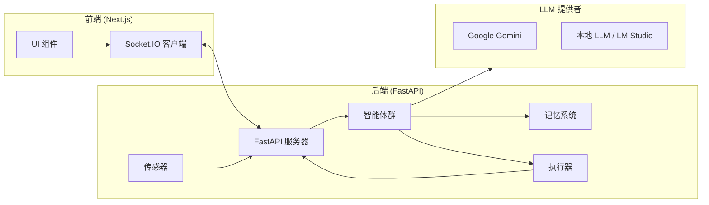
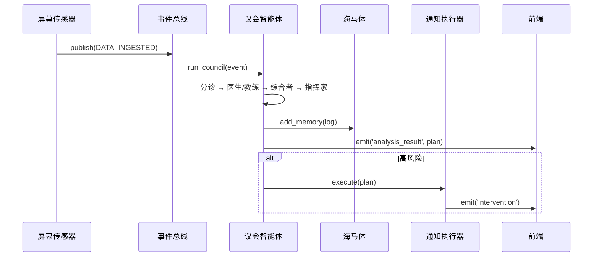
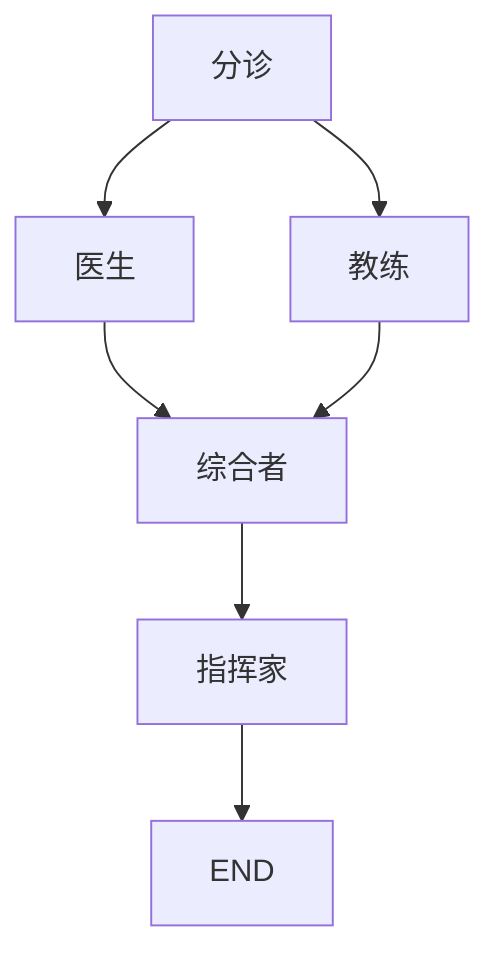

# VitalSense: 全面项目指南

> **"高度自主。高度智能。高度敏锐。"**

本指南是理解 VitalSense 的终极参考——一个下一代 **自主多智能体健康操作系统 (VitalOS)**。它涵盖了从哲学基础到高级使用模式的所有内容。

[English](PROJECT_GUIDE.md) | [中文文档](PROJECT_GUIDE_CN.md)

---

## 目录
1. [项目理念](#1-项目理念)
2. [架构与技术栈](#2-架构与技术栈)
3. [信息流与核心原则](#3-信息流与核心原则)
4. [关键技术与特性](#4-关键技术与特性)
5. [基本使用指南](#5-基本使用指南)
6. [完整能力](#6-完整能力)
7. [高级用法与示例](#7-高级用法与示例)
8. [附录](#8-附录)

---

## 1. 项目理念

### "有感知"的三位一体

VitalSense 旨在超越传统的聊天机器人和健康追踪器，渴望成为一个 **有感知的私人助理**，体现三大核心原则：

| 原则 | 描述 |
|------|------|
| **高度自主** | 无需持续指令即可行动。管理记忆、抑制警报、使用工具解决问题。 |
| **高度智能** | 使用 **GraphRAG**（图检索增强生成）理解上下文、计算时长、检测复杂模式（如"过度劳累"）。 |
| **高度敏锐** | "看"用户的屏幕（通过 LLM 视觉），"记住"历史，并构建一个不断演进的 `UserProfile`。 |

### 设计准则
- **主动，而非被动**：系统在倦怠*之前*介入，而非之后。
- **环境智能**：它在后台运行，始终观察，始终学习。
- **反馈回路**：用户的行为（关闭警报）直接调整系统的敏感度。

---

## 2. 架构与技术栈

### 高层架构图



### 技术栈概览

| 层级 | 技术 | 用途 |
|------|------|------|
| **前端** | Next.js, TypeScript, Tailwind CSS, Framer Motion, `react-force-graph-3d` | 丰富的交互式 UI，3D 图可视化。 |
| **后端** | Python, FastAPI, Socket.IO, LangGraph, LangChain | 实时 API，智能体编排。 |
| **记忆** | ChromaDB, NetworkX | 向量存储 (ChromaDB)，知识图谱 (NetworkX)。 |
| **LLM** | Google Gemini (云端), OpenAI 兼容 API (本地) | 多模态推理，结构化输出。 |
| **执行器** | `osascript` (macOS), `screen-brightness-control` | 系统通知，屏幕亮度。 |

---

## 3. 信息流与核心原则

### 事件驱动管道

VitalSense 基于 **发布-订阅 (pub/sub)** 事件总线运行。此架构解耦组件并支持并行处理。



### 关键数据结构

| 模型 | 文件 | 用途 |
|------|------|------|
| `MemoryEntry` | `schemas.py` | GraphRAG 的结构化记忆（时间戳、场景、陈述、实体、用户状态、结果）。 |
| `CouncilActionPlan` | `schemas.py` | 议会的输出（摘要、风险等级、风险类型、行动、图谱高亮）。 |
| `UserProfile` | `profile_service.py` | 持久化用户模型（特征、病症、习惯、偏好、风险调节器）。 |
| `ScreenAnalysis` | `screen_sensor.py` | 视觉分析输出（活动类别、检测到的健康风险、情绪基调、描述）。 |

---

## 4. 关键技术与特性

### 4.1 GraphRAG（图检索增强生成）

VitalSense 不仅仅是关键词匹配记忆——它构建一个 **知识图谱** 并遍历它。

| 组件 | 技术 | 角色 |
|------|------|------|
| `GraphService` | NetworkX | 存储节点（记忆、活动、症状、实体）和边（提及、导致等）。 |
| `GraphEnricher` | LLM | 使用基于提示的方法从原始文本中提取实体和关系。 |

**模式检测：**
`detect_grind_pattern()` 方法遍历图谱以查找连续的久坐活动块，计算总时长。如果超过阈值（如 60 分钟），则引发 `GRAPH_ALERT`。

---

### 4.2 多智能体议会 (LangGraph)

议会是一个 **LangGraph** 工作流，以辩论式架构编排多个专业智能体。



| 智能体 | 角色 | 职责 |
|--------|------|------|
| **分诊** | 路由器 | 扫描输入，决定是否需要医生/教练。 |
| **Dr. Nexus** | 临床医生 | 分析医学/生理症状。 |
| **守护者** | 教练 | 分析生活方式和行为模式。 |
| **主席（综合者）** | 调解人 | 结合输入，运行风险引擎，输出 `CouncilActionPlan`。 |
| **指挥家** | 环境控制器 | 调整屏幕亮度，建议环境色调。 |

---

### 4.3 混合风险引擎

`RiskEngine` 结合了快速的确定性规则和深度 GraphRAG 分析。

| 检查 | 逻辑 |
|------|------|
| **确定性** | 症状关键词匹配（"头痛"、"胸痛"）、忽视行为（"跳过一餐"）和时长乘数。 |
| **GraphRAG** | 调用 `detect_grind_pattern()` 查找知识图谱中的时间模式。 |
| **动态调节器** | 用户配置文件调节器（如 `sedentary: 1.5`）根据用户状况放大或抑制风险分数。 |

---

### 4.4 自主记忆巩固

受大脑在睡眠期间巩固记忆的启发，VitalSense 在启动时运行 **唤醒协议**：
1. **检查间隔**：如果系统关闭超过 4 小时，触发巩固。
2. **总结**：使用 LLM 将原始日志总结为高级"情节"。
3. **归档**：将原始数据移动到 `cold_storage/`（零数据丢失）。
4. **剪枝**：从 ChromaDB 中删除原始记忆，保持上下文窗口干净。

---

### 4.5 本地 LLM 支持 (LM Studio / Ollama)

VitalSense 支持 **混合大脑** 架构：

| 模式 | 提供者 | 优点 |
|------|--------|------|
| **云端** | Google Gemini | 快速、强大的多模态，无需本地资源。 |
| **本地** | LM Studio / Ollama (OpenAI 兼容) | 隐私优先，数据不离开您的机器，离线工作。 |

**自动检测**：`LocalProvider` 查询 `/v1/models` 以自动检测已加载的模型 ID，消除配置错误。

---

## 5. 基本使用指南

### 快速开始

**前置要求：**
- Python 3.10+
- Node.js 18+
- Google Gemini API Key 或 LM Studio

**步骤 1：后端**
```bash
cd backend
pip install -r requirements.txt

# 云端模式 (Gemini)
export GOOGLE_API_KEY="your_key"
python -m backend.main

# 本地模式 (LM Studio)
export LLM_PROVIDER="local"
python -m backend.main
```

**步骤 2：前端**
```bash
cd frontend
npm install
npm run dev
```

访问 `http://localhost:3000`。

---

### 与智能体交互

| 操作 | 方法 |
|------|------|
| **聊天** | 在 "Liaison AI" 聊天窗口中输入消息（右下角）。 |
| **查看记忆图谱** | "神经星座" 3D 图谱实时更新。点击节点检查。 |
| **管理记忆** | 点击图谱标题中的数据库图标打开记忆管理器。 |
| **响应警报** | 当 `RiskCard` 出现时，点击"我会修复"或"暂时不用"来提供反馈。 |

---

## 6. 完整能力

### 6.1 感知

| 传感器 | 输入 | 输出 |
|--------|------|------|
| **ScreenSensor** | 截图（每 30 秒） | `ScreenAnalysis`（活动、风险、情绪）+ Base64 缩略图。 |
| **FileSensor** | JSON 文件（`backend/data/input.json`） | 用于测试/模拟的任意事件。 |

---

### 6.2 认知（智能体工具）

**Liaison 智能体** 拥有一个包含 6 个工具的 ReAct 循环：

| 工具 | 功能 |
|------|------|
| `update_profile` | 添加/删除特征、病症、习惯。触发 `RiskEngine` 调节器。 |
| `manage_memory` | 从海马体搜索或删除记忆。 |
| `set_preference` | 设置系统偏好（如 `mute_alerts`）。 |
| `query_graph` | **智能查询**：结合时间线数据、语义搜索和过劳检测。 |
| `set_risk_override` | 在一段时间内抑制风险类型（专注模式）。 |
| `fetch_profile_context` | 检索配置文件数据（特征、病症等）。 |

---

### 6.3 行动（执行器）

| 执行器 | 动作 |
|--------|------|
| **NotificationActuator** | 为高风险事件发送 macOS 系统通知。 |
| **BrightnessActuator** | 根据指挥家的建议调整屏幕亮度。 |

---

### 6.4 前端组件

| 组件 | 用途 |
|------|------|
| **ChatInterface** | 可拖拽的聊天窗口，支持嵌入式 `RiskCard`。 |
| **MemoryGalaxy** | 3D 力导向知识图谱可视化。 |
| **CouncilRoom** | 智能体活动的实时日志。 |
| **SessionTimeline** | 带有风险指示器的屏幕快照水平时间轴。 |
| **InterventionModal** | 高风险事件的全屏警报。 |
| **BioField** | 由指挥家控制的环境背景着色器。 |

---

## 7. 高级用法与示例

### 7.1 专注模式（自主性）

**场景**：用户说"接下来 2 小时我需要专注，不要提醒我。"

**智能体流程**：
1. Liaison 识别意图。
2. 调用 `set_risk_override("duration", 2, "用户请求专注时间")`。
3. 同时调用 `set_preference("mute_alerts", "true")`。
4. 接下来 2 小时，警报被抑制。

**用户命令：**
> "接下来3小时我要开会，别烦我。"

---

### 7.2 动态用户建模（智能性）

**场景**：用户提到"我最近腰疼得厉害。"

**智能体流程**：
1. Liaison 检测到健康状况。
2. 调用 `update_profile(key="condition", value="腰痛", action="add")`。
3. `ProfileService` 自动设置 `risk_modifiers["sedentary"] = 1.5`。
4. 未来久坐警报触发速度加快 1.5 倍。

**用户命令：**
> "我被诊断出轻度干眼症。"

---

### 7.3 深度回忆（智能性）

**场景**：用户问"过去一小时我在做什么？"

**智能体流程**：
1. Liaison 调用 `query_graph("过去一小时我在做什么？")`。
2. `GraphService.get_recent_activity()` 检索带有计算时长的记忆。
3. Liaison 合成叙述："在过去一小时内，您花了 45 分钟编码（进行中），之前花了 15 分钟查看邮件。"

---

### 7.4 反馈回路（感知性）

**场景**：用户多次关闭"久坐风险"卡片。

**前端流程**：
1. 用户在 `RiskCard` 上点击"暂时不用"。
2. 前端发送 `adjust_tolerance({ risk_type: "sedentary", amount: 0.1 })`。
3. 后端调用 `risk_engine.adjust_tolerance("sedentary", 0.1)`。
4. `profile.risk_modifiers["sedentary"]` 降低（如 1.0 → 0.9）。
5. 未来的久坐警报需要更长的时间才能触发。

---

## 8. 附录

### 环境变量

| 变量 | 默认值 | 描述 |
|------|--------|------|
| `GOOGLE_API_KEY` | — | 云端模式 (Gemini) 必需。 |
| `LLM_PROVIDER` | `gemini` | 设置为 `local` 以使用本地模式。 |
| `LOCAL_LLM_URL` | `http://localhost:1234/v1` | 本地 LLM API 的基础 URL。 |
| `LOCAL_LLM_MODEL` | 自动检测 | 如果需要，覆盖模型 ID。 |

### 文件结构（关键文件）

```
VitalSense/
├── backend/
│   ├── main.py               # 入口点，Socket.IO，生命周期
│   ├── agents/
│   │   ├── liaison.py        # 面向用户的 ReAct 智能体
│   │   ├── council.py        # 多智能体 LangGraph 工作流
│   │   ├── maestro.py        # 环境控制器
│   │   ├── personas.py       # 所有提示词
│   │   └── schemas.py        # Pydantic 模型
│   ├── core/
│   │   ├── memory.py         # 海马体 (ChromaDB)
│   │   ├── graph_service.py  # 知识图谱 (NetworkX)
│   │   ├── risk_engine.py    # 混合风险评估
│   │   ├── profile_service.py# 用户配置文件管理
│   │   ├── llm.py            # LLM 提供者（Gemini, 本地）
│   │   ├── events.py         # EventBus
│   │   ├── pulse.py          # VitalPulse 心跳
│   │   └── actuators.py      # 系统动作
│   └── perception/
│       ├── screen_sensor.py  # 基于视觉的传感器
│       └── file_sensor.py    # JSON 文件监视器
├── frontend/
│   ├── app/page.tsx          # 主页布局
│   ├── components/
│   │   ├── ChatInterface.tsx # 聊天 + RiskCard
│   │   ├── MemoryGalaxy.tsx  # 3D 图谱
│   │   ├── CouncilRoom.tsx   # 智能体日志
│   │   └── SessionTimeline.tsx# 快照
│   └── lib/socket.ts         # Socket.IO 客户端
└── PROJECT_GUIDE_CN.md       # 本文件
```

---

*本指南基于对 VitalSense 代码库的全面分析自动生成。*
